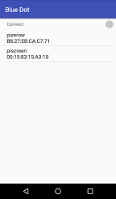

Blue Dot Android App
====================

The `Blue Dot app`_ is available to download from the Google Play store.

Please leave a rating and review if you find Blue Dot useful :)

|bluedotapp| |bluedotappdevices|

Start
-----

1. Download the `Blue Dot app`_ from the Google Play store.

2. If you havent already done so, pair your raspberry pi as described in the
   :doc:`gettingstarted` guide.

3. Run the Blue Dot app

   |bluedotappicon|

4. Select your Raspberry Pi from the paired devices list

   |bluedotappdevices|

5. Press the Dot

   |bluedotapp|

.. _Blue Dot app: http://play.google.com/store/apps/details?id=com.stuffaboutcode.bluedot

.. |bluedotapp| image:: images/bluedotandroid_small.png
   :alt: Screenshot of Blue Dot app

