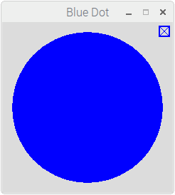
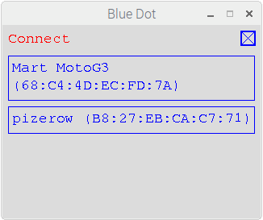

Blue Dot Python App
===================

Blue Dot Python app allows you to use another Raspberry Pi (or linux based computer) as the Blue Dot remote.

|bluedotpython| |bluedotpythondevices|

Start
-----

The app is included in the bluedot Python library:

1. If you havent already done so, pair your raspberry pi and install the Python
   library as described in the :doc:`gettingstarted` guide

2. Run the Blue Dot app::

    bluedotapp

3. Select your Raspberry Pi from the paired devices list

   |bluedotpythondevices|

4. Press the Dot

   |bluedotpython|

Options
-------

To get help with the Blue Dot app options::

    bluedotapp --help

If you have more than 1 bluetooth device you can use ``--device`` to use a particular device::

    bluedotapp --device hci1

You can specify the server to connect to at startup by using the ``--server`` option::

    bluedotapp --server myraspberrypi

The screen size of the Blue Dot app can be changed using the ``width`` and ``height`` options and specifying the number of pixels::

    bluedotapp --width 500 --height 500

The app can also be used full screen, if no ``width`` or ``height`` is given the screen will be sized to the current resolution of the screen::

    bluedotapp --fullscreen

