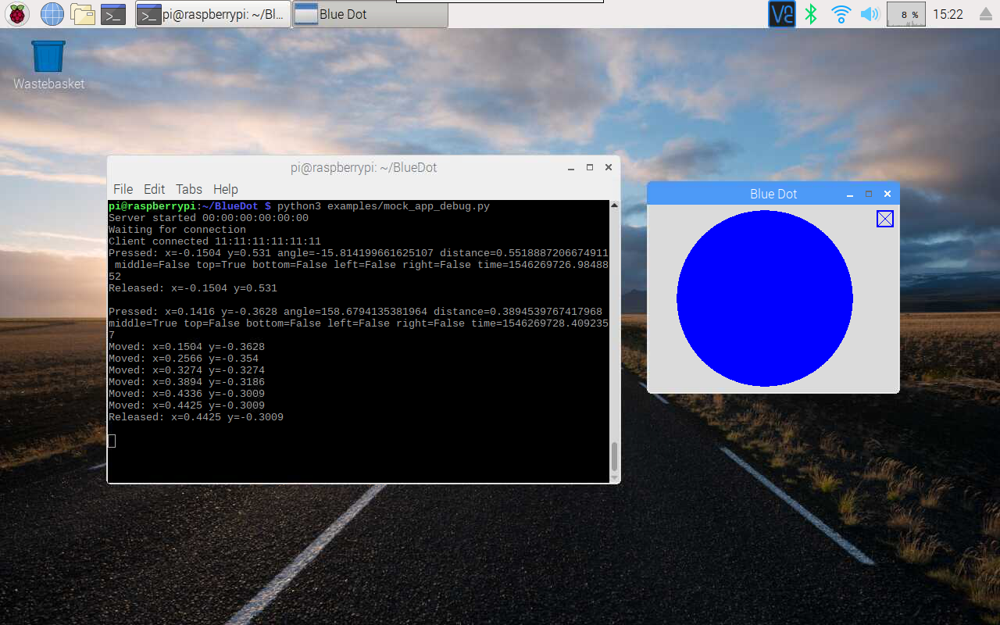

Recipes
=======

button
------

The simplest way to use the Blue Dot is as a wireless button.

hello world
~~~~~~~~~~~

When the Blue Dot is pressed, lets say Hello World::

    from bluedot import BlueDot
    bd = BlueDot()
    bd.wait_for_press()
    print("Hello World")

Alternatively you can also use ``when_pressed`` to call a function::

    from bluedot import BlueDot
    from signal import pause

    def say_hello():
        print("Hello World")

    bd = BlueDot()
    bd.when_pressed = say_hello

    pause()

``wait_for_release()`` and ``when_released`` also allow you to interact when the Blue Dot is released::

    from bluedot import BlueDot
    from signal import pause

    def say_hello():
        print("Hello World")

    def say_goodbye():
        print("goodbye")

    bd = BlueDot()
    bd.when_pressed = say_hello
    bd.when_released = say_goodbye

    pause()

flash an led
~~~~~~~~~~~~

Using Blue Dot in combination with `gpiozero`_ you can interact with electronic components, such as LED's, connected to your Raspberry Pi. 

When the Blue Dot is pressed, the LED will turn on, when released it will turn off::

    from bluedot import BlueDot
    from gpiozero import LED

    bd = BlueDot()
    led = LED(pin)

    bd.wait_for_press()
    led.on()

    bd.wait_for_release()
    led.off()

You could also use ``when_pressed`` and ``when_released``::

    from bluedot import BlueDot
    from gpiozero import LED
    from signal import pause

    bd = BlueDot()
    led = LED(pin)

    bd.when_pressed = led.on
    bd.when_released = led.off

    pause()

Alternatively use ``LED.source`` and ``BlueDot.values``::

    from bluedot import BlueDot
    from gpiozero import LED
    from signal import pause

    bd = BlueDot()
    led = LED(pin)

    led.source = bd.values

    pause()

remote camera
~~~~~~~~~~~~~

Using a Raspberry Pi camera, `picamera`_ and Blue Dot you can really easily create a remote camera ::

    from bluedot import BlueDot
    from picamera import PiCamera
    from signal import pause
    
    bd = BlueDot()
    cam = PiCamera()

    def take_picture():
        cam.capture("pic.jpg")

    bd.when_pressed = take_picture

    pause()

joystick
--------

The Blue Dot can also be used as a joystick when the middle, top, bottom, left or right areas of the dot are used.

d pad
~~~~~

Using the position the BlueDot was pressed you can work out whether it was pressed to go up, down, left, right like the dpad on a joystick ::

    from bluedot import BlueDot
    from signal import pause

    def dpad(pos):
        if pos.top:
            print("up")
        elif pos.bottom:
            print("down")
        elif pos.left:
            print("left")
        elif pos.right:
            print("right")

    bd = BlueDot()
    bd.when_pressed = dpad

    pause()

At the moment the dpad on registers a movement when it is pressed, to get it work when the position is moved you should add ::

    bd.when_moved = dpad

robot
~~~~~

to come

variable speed robot
~~~~~~~~~~~~~~~~~~~~

to come

slider
------

By holding down the Blue Dot and moving the position you can use it as an analogue slider.

center out
~~~~~~~~~~

to come

left to right
~~~~~~~~~~~~~

to come

fade an led
~~~~~~~~~~~

to come

testing
-------

bluedot includes a MockBlueDot class to allow you to test and debug your programming without having to use bluetooth or a Blue Dot client.

MockBlueDot inherits from BlueDot and is used in the same way, but you have the option of launching a mock app which you can click with a mouse or writing scripts to simulate the Blue Dot being used.

|mockbluedot|

The mock app uses pygame, which you may need to install ::

    sudo apt-get install python3-pygame

Or if you are using Python 2 ::

    sudo apt-get install python-pygame

mock app
~~~~~~~~

Launch the mock Blue Dot app to test by clicking the on-screen dot with the mouse ::

    from bluedot import MockBlueDot

    def say_hello():
        print("Hello World")

    bd = MockBlueDot()
    bd.when_pressed = say_hello

    bd.launch_mock_app()

scripted tests
~~~~~~~~~~~~~~

Tests can also be scripted using MockBlueDot ::

    from bluedot import MockBlueDot

    def say_hello():
        print("Hello World")

    bd = MockBlueDot()
    bd.when_pressed = say_hello

    bd.mock_blue_dot_pressed()

.. _gpiozero: https://gpiozero.readthedocs.io
.. _picamera: https://picamera.readthedocs.io

